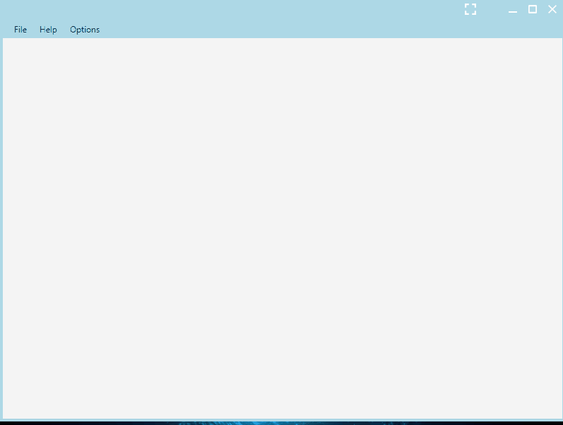

# JMarkPad

JMarkPad is a minimalistic text editor that shows a real-time preview of how your markdown text would look like on your blog, github page or your own website.

## General information 

### Installing

To use JMarkPad you only need to download and double click on the executable:

* Download "JMarkPad.jar" if you already have Java 8 installed.
* Download "JMarkPad.zip" if you don't have Java 8 installed. 

[Download the latest version here](https://github.com/mayuso/JMarkPad/releases)

### Roadmap

We are constantly trying to improve JMarkPad, you can see the known bugs and planned enhancements on our [issues list](https://github.com/mayuso/JMarkPad/issues).

### Other useful information

## Development

### How to build

1. Download and install [OpenJDK 13](https://jdk.java.net/13/).
2. Download and install [Maven](https://maven.apache.org/download.cgi) (Latest version tested: 3.6.2).

* To run JMarkPad run `mvn clean javafx:run`
* To create an executable package run `mvn clean compile package`

    The file will be located in `target/JMarkPad.jar`

